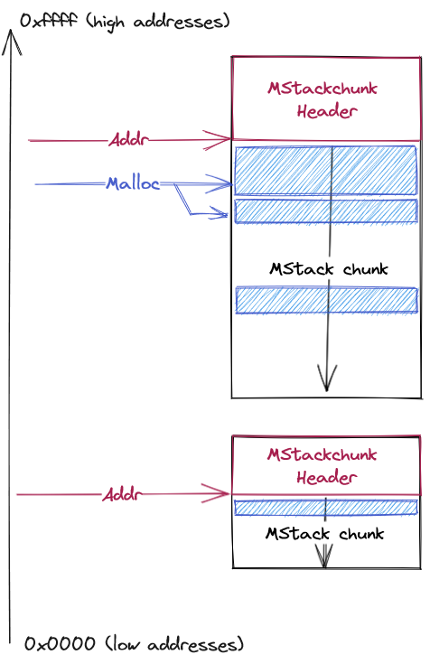

# Malloc

The aim of this project is to build a malloc implementation offering 3 buckets:
 - a first one for tiny memory blocks
 - second one for small memory blocks
 - third one for the other ones

## Implementation
It is important to notice that `mmap` produces a stack-like memory structure.
Thus, I need to manage this stack like first.

### stack of pages
The `mmap` area is mainly growing down. Thus, I chosed to pack all the
informations at the top-addresses of the allocated pages. It induces many
constraints on how to behave on the area, like moving on the pages to write the
header, and not just write it after maping. But it should provide a much easier
way to merge areas and extend it mermory size under normal use conditions.

